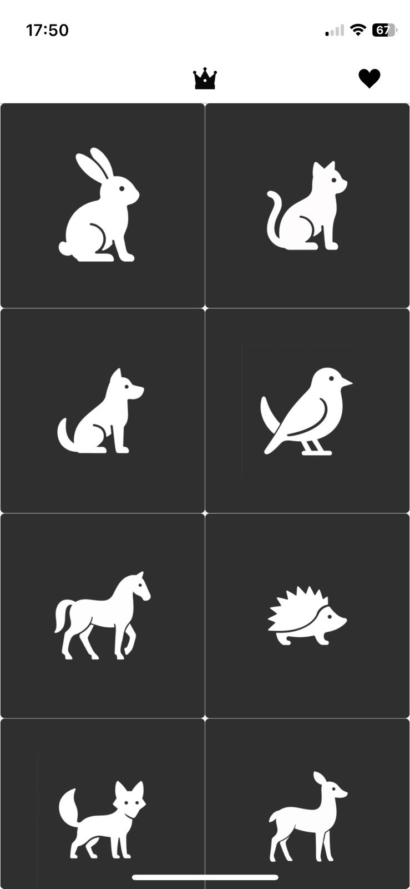
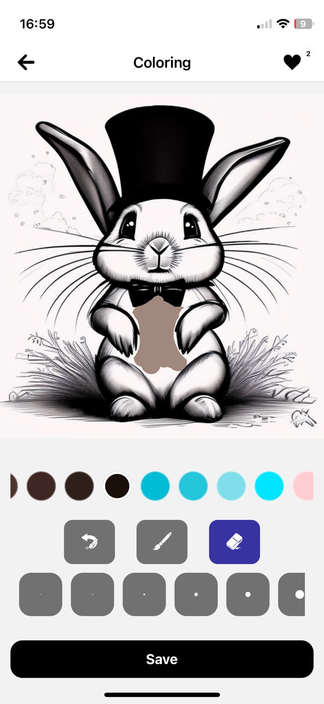
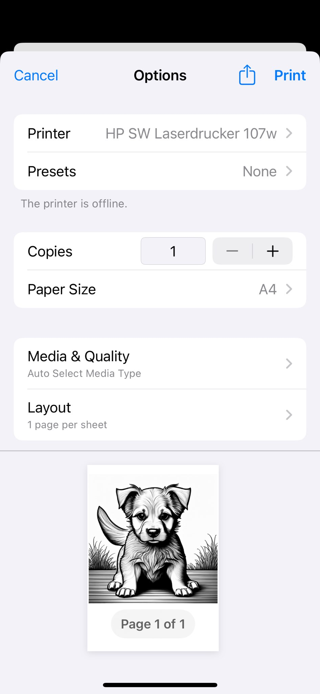
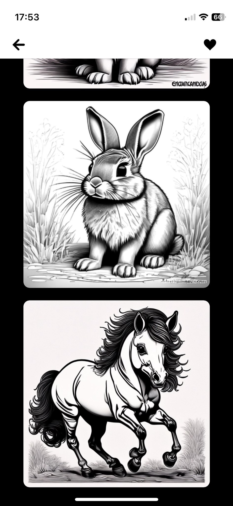
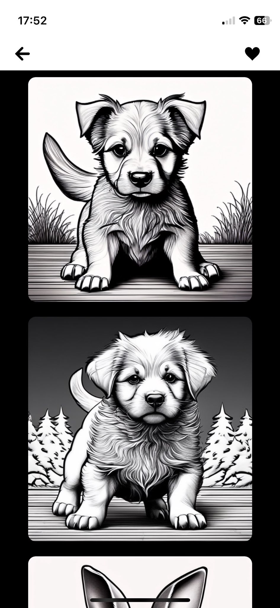
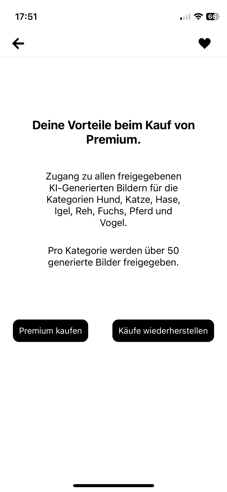
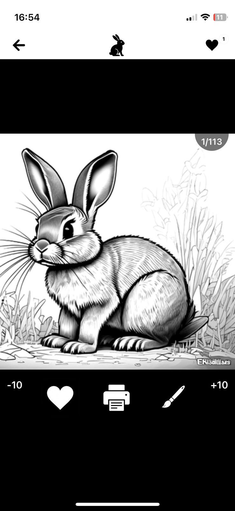

# Hallo, ich bin Stefanie 👋

Ich bin Softwareentwicklerin mit Erfahrung in der mobilen App-Entwicklung und Web-Entwicklung. Ich arbeite gerne mit modernen Technologien über den gesamten Stack hinweg — vom React-Native-Frontend bis zum Spring-Boot-Backend.

## Mein Tech Stack

**Frontend & Mobile:** React Native, Expo, JavaScript, TypeScript, HTML, CSS  
**Backend:** Java, Spring Boot, PHP  
**Tools & DevOps:** Git, Docker, GitHub Actions, EAS Build & Update  
**Sonstiges:** REST APIs, i18n/Lokalisierung, RevenueCat (In-App-Käufe)

---

## Projekte

### 🎨 Coloring Pictures - Ausmalbilder
**Mobile Ausmal-App für iOS & Android** · [Im App Store ansehen](https://apps.apple.com/de/app/coloring-pictures/id6756795786)

Eine App, in der Nutzer aus einer Sammlung von SVG-Bildern wählen und diese digital ausmalen können. Die fertigen Werke lassen sich speichern und drucken.

  
  
  
  

  
  
  

**Highlights:**
- 📱 Veröffentlicht im **Apple App Store**
- Cross-Platform App mit **React Native 0.81** und **Expo SDK 54**
- **Mehrsprachig** (Deutsch, Englisch u. a.) via i18next + expo-localization
- **In-App-Käufe** und Abo-Modell über RevenueCat
- SVG-Rendering mit Touch- und Swipe-Gesten
- CI/CD-Pipeline mit **GitHub Actions** und **EAS Build**
- Over-the-Air-Updates ohne App-Store-Freigabe
- Hermes JS Engine mit aktivierter New Architecture

**Tech:** React Native · Expo · React Navigation · i18next · RevenueCat · react-native-svg · Axios

---

### 🌐 Website Backend
**Fullstack-Webprojekt mit React & Spring Boot**

Ein Webprojekt bestehend aus einem React-Frontend und einem Java-Backend mit Spring Boot. Containerisiert mit Docker für einfaches Deployment.

**Highlights:**
- RESTful API mit **Spring Boot**
- Containerisierung mit **Docker** und **Docker Compose**
- Maven-basiertes Build-Management

**Tech:** Java · Spring Boot · React · Docker · Maven

---

### 📋 AuftragsService
**Service-Anwendung in TypeScript**

Ein Service zur Auftragsverwaltung, umgesetzt in TypeScript.

**Tech:** TypeScript

---

## Code-Zugang

Meine Repositories sind privat. Wenn Sie im Rahmen eines Bewerbungsprozesses Einblick in den Quellcode erhalten möchten, kontaktieren Sie mich gerne:

📧 [E-Mail](mailto:DEINE-EMAIL@beispiel.de)  
💼 [LinkedIn](https://linkedin.com/in/DEIN-PROFIL)

Ich schalte Ihnen zeitnah einen Lesezugang frei.

<!--
**7353Stefanie/7353Stefanie** is a ✨ _special_ ✨ repository because its `README.md` (this file) appears on your GitHub profile.

Here are some ideas to get you started:

- 🔭 I’m currently working on ...
- 🌱 I’m currently learning ...
- 👯 I’m looking to collaborate on ...
- 🤔 I’m looking for help with ...
- 💬 Ask me about ...
- 📫 How to reach me: ...
- 😄 Pronouns: ...
- ⚡ Fun fact: ...
-->
