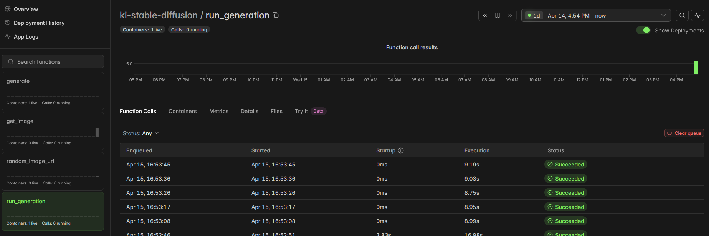

# Hallo, ich bin Stefanie 

Ich bin Softwareentwicklerin mit Erfahrung in der mobilen App-Entwicklung und Web-Entwicklung. Ich arbeite gerne mit modernen Technologien über den gesamten Stack hinweg — vom React-Native-Frontend bis zum Spring-Boot-Backend, inklusive KI-gestützter Bildgenerierung.

## Mein Tech Stack

**Frontend & Mobile:** Angular, React Native, Expo, JavaScript, TypeScript, HTML, CSS  
**Backend:** Java, Spring Boot, PHP  
**KI & ML:** Stable Diffusion 2.1, LoRA Fine-Tuning, Modal (Serverless GPU)  
**Tools & DevOps:** Git, Docker, GitHub Actions, EAS Build & Update  
**Sonstiges:** REST APIs, i18n/Lokalisierung, RevenueCat (In-App-Käufe)

---

## Projekte

###  Coloring Pictures - Ausmalbilder
**Mobile Ausmal-App für iOS & Android** · [Im App Store ansehen](https://apps.apple.com/de/app/coloring-pictures/id6756795786)

Eine App, in der Nutzer aus einer Sammlung von SVG-Bildern wählen und diese digital ausmalen können. Die fertigen Werke lassen sich speichern und drucken. Die Ausmalbilder werden mit einer **eigenen KI-Pipeline** generiert (→ siehe [KI-Bildgenerierung](#-ki-bildgenerierung-für-coloring-pictures)).

  
  
  
  

  
  
  

**Highlights:**
- 📱 Veröffentlicht im **Apple App Store**
- Cross-Platform App mit **React Native 0.81** und **Expo SDK 54**
- **KI-generierte Ausmalbilder** über eigene Stable-Diffusion-Pipeline (siehe unten)
- **Mehrsprachig** (Deutsch, Englisch u. a.) via i18next + expo-localization
- **In-App-Käufe** und Abo-Modell über RevenueCat
- SVG-Rendering mit Touch- und Swipe-Gesten
- CI/CD-Pipeline mit **GitHub Actions** und **EAS Build**
- Over-the-Air-Updates ohne App-Store-Freigabe
- Hermes JS Engine mit aktivierter New Architecture

**Tech:** React Native · Expo · React Navigation · i18next · RevenueCat · react-native-svg · Axios

---

###  KI-Bildgenerierung für Coloring Pictures
**Serverless Image-Generation-Pipeline auf Modal**

Eine eigenständige KI-Pipeline, die automatisiert Ausmalbilder für die Coloring-Pictures-App erzeugt. Basierend auf **Stable Diffusion 2.1** mit **kategoriespezifischen LoRA-Weights** — jede Tierkategorie (z. B. Hunde, Katzen, Pferde) wurde individuell trainiert, um stilistisch passende Ausmalvorlagen zu generieren.

  

**Highlights:**
- **Stable Diffusion 2.1** als Base-Modell mit **LoRA Fine-Tuning**
- Eigene **LoRA-Weights pro Tierkategorie** für konsistenten Stil
- Serverless GPU-Infrastruktur auf **Modal** (~9 Sek. pro Bild)
- Mehrere Funktionen: `generate`, `get_image`, `random_image_url`, `run_generation`
- Automatisierte Batch-Generierung neuer Ausmalbilder
- Bilder werden als SVG-taugliche Vorlagen für die App aufbereitet

**Tech:** Python · Stable Diffusion 2.1 · LoRA · Modal · Serverless GPU

---

###  Website Backend
**Fullstack-Webprojekt mit React & Spring Boot**

Ein Webprojekt bestehend aus einem React-Frontend und einem Java-Backend mit Spring Boot. Containerisiert mit Docker für einfaches Deployment.

**Highlights:**
- RESTful API mit **Spring Boot**
- Containerisierung mit **Docker** und **Docker Compose**
- Maven-basiertes Build-Management

**Tech:** Java · Spring Boot · React · Docker · Maven

---

###  AuftragsService
**Fullstack-Demo: Auftragsverwaltung mit Angular & Java**

Ein Beispielprojekt zur Demonstration meiner Fullstack-Kenntnisse. Bildet einen Service zur Prüfauftragsverwaltung ab — mit Angular-Frontend, Java-Backend und Docker-Container inkl. Datenbank.

**Highlights:**
- **Angular**-Frontend mit TypeScript (eigener Ordner `AuftragsServiceFrontend`)
- **Java**-Backend mit REST API (`AuftragsServiceBackend`)
- **SQL-Datenbank** im Docker-Container
- Saubere Trennung von Frontend und Backend in einem Monorepo
- Per **Docker** direkt startbar

**Tech:** Angular · TypeScript · Java · SQL · Docker · CSS · HTML

---

## Code-Zugang

Meine Repositories sind privat. Wenn Sie im Rahmen eines Bewerbungsprozesses Einblick in den Quellcode erhalten möchten, kontaktieren Sie mich gerne:

[E-Mail](mailto: coloringpicturesforkids@gmail.com )  
[LinkedIn](https://linkedin.com/in/stefanie-b-90113a217/ )

Ich schalte Ihnen zeitnah einen Lesezugang frei.

